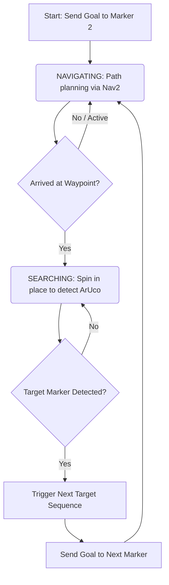

# ArUco Marker Command-Following Differential Drive Robot

An autonomous ROS 2 differential drive robot that navigates through a Gazebo simulation environment by detecting ArUco markers and executing sequential navigation commands.

---

## 📌 Project Overview

This project simulates a differential drive robot equipped with a camera, LiDAR, and differential drive actuators. The robot leverages **SLAM Toolbox** for mapping, **Nav2** for path planning, and an **ArUco Command Follower** node to coordinate navigation. 

The robot starts with an initial target (Marker 2), navigates to the preconfigured waypoint in front of it, spins to search/detect the marker, and then proceeds to the next target marker in a continuous cycle:



### 🎯 Marker Navigation Cycle

| Current Target Marker ID | Target Wall | Next Waypoint / Marker Target | Action Command |
| :---: | :---: | :---: | :---: |
| **2** | Wall 3 | **3** (Wall 4) | Navigate to Wall 4 (Marker 3) |
| **3** | Wall 4 | **4** (Wall 5) | Navigate to Wall 5 (Marker 4) |
| **4** | Wall 5 | **0** (Wall 1) | Navigate to Wall 1 (Marker 0) |
| **0** | Wall 1 | **1** (Wall 2) | Navigate to Wall 2 (Marker 1) |
| **1** | Wall 2 | **2** (Wall 3) | Navigate to Wall 3 (Marker 2) |

---

## 📂 Repository Structure

This repository is organized into three distinct versions of the project, allowing you to run the robot under different launch configurations and environments:

### 1. Root Directory (XML Launch Version)
The root `src/` directory contains the original ROS 2 implementation using **XML Launch Files** (`my_robot.launch.xml`) and the original Gazebo world.
- To run this version, build the root workspace and run:
  ```bash
  ros2 launch my_robot_bringup my_robot.launch.xml headless:=false
  ```

### 2. Python Launch Version (`python_launch_version/`)
Contains the migrated, fully debugged, and optimized version of the robot using **Python Launch Files** (`my_robot.launch.py`) with the original Gazebo world.
- Refer to the [Python Launch README](python_launch_version/README.md) for more details.

### 3. New Maze World Version (`maze_world_version/`)
Contains the Python launch version running in a **New, more complex Maze World** layout, with the robot starting outside the maze, executing an entry sequence, and navigating updated marker locations.
- Refer to the [New Maze World README](maze_world_version/README.md) for more details.

---

## 🛠️ Prerequisites & Dependencies

To build and run this simulation, you need:

1. **OS**: Linux Ubuntu 22.04 LTS (recommended)
2. **ROS 2**: Humble Hawksbill (or newer compatible version)
3. **Gazebo**: Gazebo Sim (formerly Ignition Gazebo, e.g., Garden or Harmonic)
4. **ROS 2 Packages**:
   - `ros_gz` (bridges and integration packages)
   - `nav2_bringup` (Navigation 2 suite)
   - `slam_toolbox` (SLAM map generation)
   - `xacro` (URDF model parser)
   - `cv_bridge` (interface between ROS 2 images and OpenCV)
   - `topic_tools` (for relaying info topics)
5. **Python Libraries**:
   - `opencv-python` (with `opencv-contrib-python` for ArUco module)
   - `numpy`

Install the required ROS 2 dependencies:
```bash
sudo apt update
sudo apt install ros-$ROS_DISTRO-ros-gz \
                 ros-$ROS_DISTRO-nav2-bringup \
                 ros-$ROS_DISTRO-slam-toolbox \
                 ros-$ROS_DISTRO-xacro \
                 ros-$ROS_DISTRO-cv-bridge \
                 ros-$ROS_DISTRO-topic-tools
```

---

## 🚀 Installation & Building

1. **Clone the repository** (if not already done):
   ```bash
   git clone git@github.com:shreyabtech27-hub/ArUco-Marker-command-following-differential-drive-robot.git
   cd ArUco-Marker-command-following-differential-drive-robot
   ```

2. **Build the Workspace**:
   Use `colcon build` to compile the packages:
   ```bash
   colcon build --symlink-install
   ```

3. **Source the Workspace**:
   ```bash
   source install/setup.bash
   ```

---

## 🎮 How to Launch the Simulation

You can launch the complete simulation stack (Gazebo, Robot Spawner, SLAM, Nav2, RViz, and the ArUco Command Follower) using the unified launch file.

### Running with Gazebo GUI
To see the Gazebo environment visualization along with RViz:
```bash
ros2 launch my_robot_bringup my_robot.launch.xml headless:=false
```

### Running Headless (Default)
If you wish to run Gazebo in the background (headless) to save system resources and visualize only in RViz:
```bash
ros2 launch my_robot_bringup my_robot.launch.xml headless:=true
```

---

## ⚙️ Parameters & Customization

The ArUco follower node (`aruco_command_follower.py`) can be configured via parameters inside the launch file or at runtime:

- `initial_target_id`: The marker ID the robot initially targets (default: `2`).
- `cooldown_seconds`: Cooldown time in seconds after triggering a command to prevent double-executions (default: `2.0`).
- `search_angular_speed`: Turning speed (rad/s) when searching/spinning for markers (default: `0.25`).
- `show_camera`: Show the live OpenCV camera feed with detected markers outlined (default: `true`).

---

## ⚖️ License

This project is licensed under the Apache License 2.0. See the [LICENSE](LICENSE) file for details.
